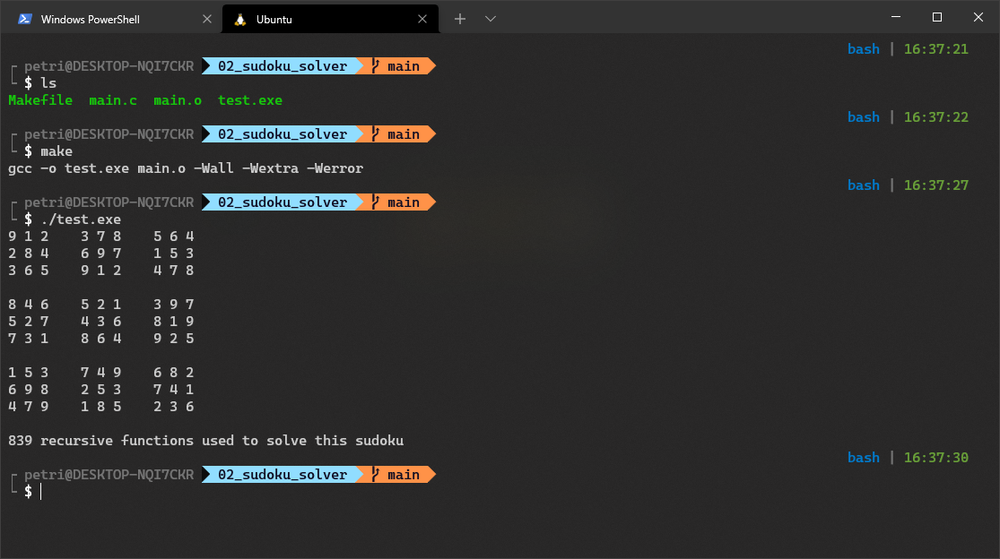

# Nice to have linux stuff


how to reload bash 
`. ~/.bashrc`

install oh my posh
https://ohmyposh.dev/docs/linux


put these lines to `~/.bashrc`

tab completes names
```bash
bind '"\t":menu-complete'
```

tab ignores cases
```bash
bind 'set completion-ignore-case on'
```
minimal ohmyposh theme

terminal emulator has to have fonts that support special characters

```bash
eval "$(oh-my-posh --init --shell bash --config ~/.poshthemes/stelbent.minimal.omp.json)"
```

:))
```bash
alias lsa='ls -a'
alias ..='cd ..;pwd'
alias ...='cd ../..;pwd'
alias ....='cd ../../..;pwd'
alias cdome='cd ~/;pwd'
```
for WSL 
```bash
alias cddes='cd /mnt/c/Users/<name>/Desktop/;pwd'
```
